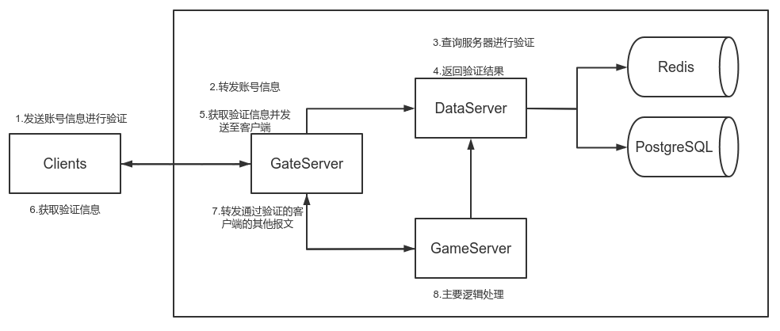

# TinyGameServer

基于`libevent`开发的C++异步非阻塞多线程游戏网络框架，目前仅包含TCP协议。

其中的某些设计理念参考了[muduo](https://github.com/chenshuo/muduo)

## 现有特点

- 网络部分基于`libevent`开发，提供了高性能、高并发的非阻塞全异步网络IO；
- 持久化层使用了`PostgreSQL`，将`Redis`作为缓存，提高了性能；
- 使用了现代`C++11/14`特性，避免使用裸指针，使用lambda或函数对象作为回调，使得代码更加安全、简洁和优雅；
- 使用`one loop per thread`模型，每个线程仅有一个`EventLoop`对象，通过负载均衡机制将连接的读写事件注册至子线程中；
- 基于TCP的自定义协议报文；
- 客户端和应用端接口简单易用。

## 现有框架




## 依赖

`libevent` 

`hiredis` 

`libpq` 

## 示例代码

```c++
// echo_server.cpp

#include "EventLoop.h"
#include "TCPServer.h"
#include "Buffer.h"

#include <signal.h>

#include <iostream>

int main()
{
    signal(SIGPIPE, SIG_IGN);
    signal(SIGHUP, SIG_IGN);
    
    auto loop = std::make_shared<EventLoop>();
    loop->Init();
    
    auto message_functor = [](ConnSPtr conn) -> int
    {
        auto buf = std::make_shared<Buffer>();
        auto str = conn->GetBuffer()->ReadString(100);

        std::cout << conn->GetSerialId() << ":" << str << std::endl;
        
        buf->AppendString(str);
        conn->Send(buf);
        
        return 0;
    };
    
    std::string addr = "0.0.0.0:10000";
    int thread_num = 4;
    TCPServer server(loop, addr, thread_num);
    server.SetMessageCallBack(message_functor);
    server.Start();
    
    loop->Run();
    
    return 0;
}

```


## 版本

### V0.1

